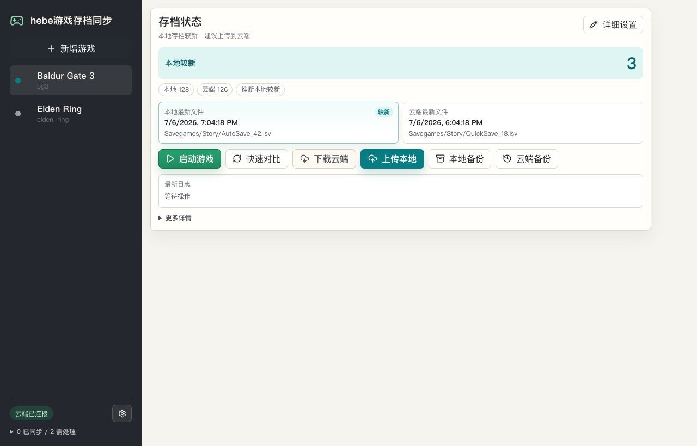
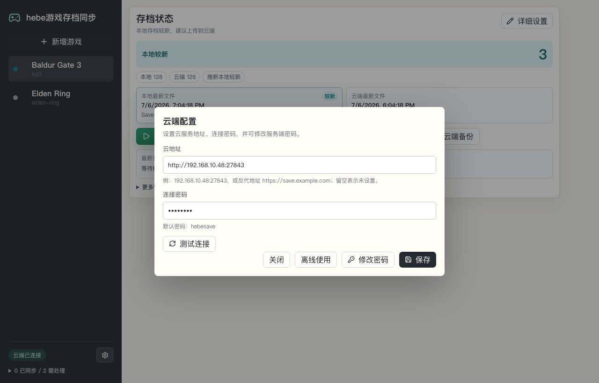
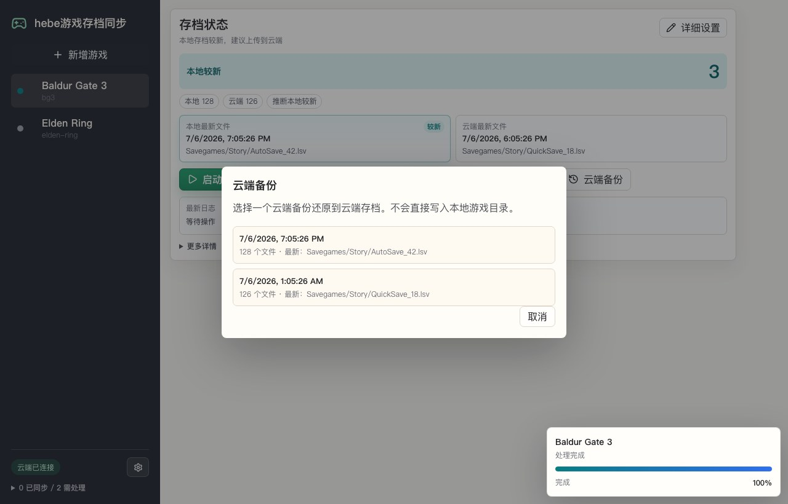

# Hebe 游戏存档同步

一个自部署的游戏存档管理器。服务端跑在自己的 NAS / 服务器上，Windows 客户端负责本地存档和云端存档的对比、上传、下载、备份、还原和启动游戏。

适合想把游戏存档放在自己 NAS 上管理的人，不依赖第三方网盘。

## NAS Docker 一键部署

先在 NAS 上准备一个持久化目录，例如群晖：

```bash
mkdir -p /volume1/docker/hebesave
```

然后运行服务端：

```bash
docker run -d --name hebe-save-server --restart unless-stopped -p 27843:27843 -v /volume1/docker/hebesave:/data ghcr.io/lixibi/hebe-save-server:latest
```

如果你的 NAS 路径不同，只改 `-v` 左边：

```bash
-v /你的/NAS/目录/hebesave:/data
```

测试服务是否启动：

```bash
curl http://NAS_IP:27843/health
```

默认连接密码是：

```text
hebesave
```

第一次连接成功后，建议在客户端里修改密码。

## 下载 Windows 客户端

下载地址：

[GitHub Releases](https://github.com/lixibi/hebe-gamesavemanger/releases/latest)

Windows x64 客户端文件名：

```text
hebe-game-save-sync-windows-x64.exe
```

把 exe 放到任意目录运行即可。程序会在同级目录保存本机配置和本地备份。

## 客户端怎么设置

1. 打开客户端左下角的云端配置。
2. 云地址填写 `http://NAS_IP:27843`，如果用了反代，也可以填 `https://save.example.com`。
3. 连接密码填写 `hebesave`，测试连接，保存。
4. 新增游戏，设置游戏名、游戏标识名、本机存档目录、游戏 exe 或 `steam://` 启动地址。
5. 首次上传本地存档到云端，之后按提示对比、上传、下载或还原备份。

## 界面预览

主界面：



云端配置：



云端备份：



## 注意事项

- 上传本地会覆盖云端存档。
- 下载云端会覆盖本地游戏存档。
- 覆盖前程序会先做备份，每个游戏保留最新 5 个备份。
- 同步时会跳过完全相同的文件，只处理变化文件。
- 仍然建议 NAS 目录自己再做快照或备份，游戏存档很重要。

## 自己构建

项目包含 Windows Wails 客户端和 Go 服务端。GitHub Actions 会自动构建 Windows x64 客户端、Linux x64 服务端和 Docker 镜像。

本地构建 Windows 客户端：

```bash
wails build -platform windows/amd64 -clean
```

本地构建服务端：

```bash
CGO_ENABLED=0 GOOS=linux GOARCH=amd64 go build -trimpath -ldflags="-s -w" -o build/bin/hebe-save-server-linux-x64 ./cmd/save-server
```
